[English](README.md) · [中文](README.zh.md)

# Learn DeepSeek Agent Tutorial — Harness Engineering for Real Agents

## Agency Comes from the Model. An Agent Product = Model + Harness.

This repository is a DeepSeek adaptation of the `learn-claude-code` tutorial. It keeps the same harness-engineering progression, but every runnable example uses DeepSeek's OpenAI-compatible API:

```text
DEEPSEEK_API_KEY + https://api.deepseek.com + deepseek-v4-flash
```

The model supplies the intelligence. The harness supplies the environment in which it can act: tools, observations, permissions, and extension points.

```text
Harness = Tools + Knowledge + Observation + Action Interfaces + Permissions
```

You are not writing intelligence. You are building the world that intelligence inhabits.

---

## The Agent Pattern

```text
User → messages[] → LLM → tool calls?
                         ├─ yes → execute tools → append results → loop
                         └─ no  → return final text
```

## Core Pattern

```python
def agent_loop(messages):
    while True:
        response = client.chat.completions.create(
            model=MODEL, messages=messages, tools=TOOLS, max_tokens=8000,
        )
        message = response.choices[0].message
        messages.append(message.model_dump(exclude_none=True))

        if not message.tool_calls:
            return

        for tool_call in message.tool_calls:
            name = tool_call.function.name
            arguments = json.loads(tool_call.function.arguments)
            output = TOOL_HANDLERS[name](**arguments)
            messages.append({
                "role": "tool",
                "tool_call_id": tool_call.id,
                "content": output,
            })
```

The loop is constant. Tools, permissions, and extensions change around it.

---

## Setup

```sh
pip install -r requirements.txt
cp .env.example .env
# Edit .env and set DEEPSEEK_API_KEY
```

The default model is `deepseek-v4-flash`. Never commit your `.env` file.

---

## Current Lessons

| Lesson | Topic | What it adds |
|---|---|---|
| [s01](s01_agent_loop/) | Agent Loop | One loop and one Bash tool |
| [s02](s02_tool_use/) | Tool Use | Five tools and dispatch through `TOOL_HANDLERS` |
| [s03](s03_permission/) | Permission | Deny list, risk rules, and user approval |
| [s04](s04_hooks/) | Hooks | Extension points before and after tool execution |
| [s05](s05_todo_write/) | TodoWrite | Stateful plans and reminders for multi-step work |
| [s06](s06_subagent/) | Subagent | Fresh context for focused delegated tasks |
| [s07](s07_skill_loading/) | Skill Loading | A compact skill catalog and on-demand instructions |
| [s08](s08_context_compact/) | Context Compact | Persist, trim, and summarize long conversations |
| [s09](s09_memory/) | Memory | Recall and consolidate durable knowledge |
| [s10](s10_task_system/) | Task System | Persistent tasks, dependencies, and progress |
| [s11](s11_background_tasks/) | Background Tasks | Run independent shell work without blocking the agent |

## Learning Path

```mermaid
flowchart LR
    S01["s01: Agent Loop"] --> S02["s02: Tool Use"]
    S02 --> S03["s03: Permission"]
    S03 --> S04["s04: Hooks"]
    S04 --> S05["s05: TodoWrite"]
    S05 --> S06["s06: Subagent"]
    S06 --> S07["s07: Skill Loading"]
    S07 --> S08["s08: Context Compact"]
    S08 --> S09["s09: Memory"]
    S09 --> S10["s10: Task System"]
    S10 --> S11["s11: Background Tasks"]
```



Start with s01 and run each chapter from the repository root:

```sh
python s01_agent_loop/code.py
python s02_tool_use/code.py
python s03_permission/code.py
python s04_hooks/code.py
python s05_todo_write/code.py
python s06_subagent/code.py
python s07_skill_loading/code.py
python s08_context_compact/code.py
python s09_memory/code.py
python s10_task_system/code.py
python s11_background_tasks/code.py
```

> Safety: these tutorials can execute model-generated commands. Use a dedicated practice directory and read the permission lesson before granting approval to destructive operations.

---

## Source and Scope

The lesson structure and teaching style are adapted from [lyq1119/learn-claude-code](https://github.com/lyq1119/learn-claude-code). This repository only changes the runnable API integration to DeepSeek while keeping the lesson focus on harness engineering.
