[English](README.md) · [中文](README.zh.md)

# Learn DeepSeek Agent Tutorial — 从零理解 Agent Harness

## Agent 的智能来自模型，Agent 产品 = 模型 + Harness

这是对 `learn-claude-code` 教程的 DeepSeek 适配版。教程保留原有的 harness engineering 学习路径，所有可运行代码则统一使用 DeepSeek 的 OpenAI 兼容接口：

```text
DEEPSEEK_API_KEY + https://api.deepseek.com + deepseek-v4-flash
```

模型负责智能和决策；harness 负责提供可行动的环境：工具、观察、权限与扩展点。

```text
Harness = 工具 + 知识 + 观察 + 行动接口 + 权限
```

你不是在用代码制造智能，而是在为智能构建它可以工作的世界。

---

## Agent 的核心模式

```text
用户 → messages[] → LLM → 是否调用工具？
                         ├─ 是：执行工具 → 追加结果 → 继续循环
                         └─ 否：返回最终回答
```

## 核心循环

```python
def agent_loop(messages):
    while True:
        response = client.chat.completions.create(
            model=MODEL, messages=messages, tools=TOOLS, max_tokens=8000,
        )
        message = response.choices[0].message
        messages.append(message.model_dump(exclude_none=True))

        if not message.tool_calls:
            return

        for tool_call in message.tool_calls:
            name = tool_call.function.name
            arguments = json.loads(tool_call.function.arguments)
            output = TOOL_HANDLERS[name](**arguments)
            messages.append({
                "role": "tool",
                "tool_call_id": tool_call.id,
                "content": output,
            })
```

循环本身保持稳定；工具、权限和扩展机制在它周围不断增加。

---

## 准备环境

```sh
pip install -r requirements.txt
cp .env.example .env
# 编辑 .env，填入 DEEPSEEK_API_KEY
```

默认模型为 `deepseek-v4-flash`。请勿提交 `.env` 文件。

---

## 当前章节

| 章节 | 主题 | 新增机制 |
|---|---|---|
| [s01](s01_agent_loop/) | Agent Loop | 一个循环 + 一个 Bash 工具 |
| [s02](s02_tool_use/) | Tool Use | 五个工具与 `TOOL_HANDLERS` 分发 |
| [s03](s03_permission/) | Permission | 拒绝列表、风险规则与用户审批 |
| [s04](s04_hooks/) | Hooks | 工具执行前后的扩展点 |
| [s05](s05_todo_write/) | TodoWrite | 带状态的计划与多步骤任务提醒 |
| [s06](s06_subagent/) | Subagent | 为明确子任务提供全新上下文 |
| [s07](s07_skill_loading/) | Skill Loading | 精简技能目录与按需加载指引 |
| [s08](s08_context_compact/) | Context Compact | 持久化、裁剪和总结长对话 |
| [s09](s09_memory/) | Memory | 召回并合并持久知识 |
| [s10](s10_task_system/) | Task System | 持久任务、依赖与进度 |
| [s11](s11_background_tasks/) | Background Tasks | 让独立 Shell 工作不阻塞 Agent |

## 学习路径

```mermaid
flowchart LR
    S01["s01：Agent Loop"] --> S02["s02：Tool Use"]
    S02 --> S03["s03：Permission"]
    S03 --> S04["s04：Hooks"]
    S04 --> S05["s05：TodoWrite"]
    S05 --> S06["s06：Subagent"]
    S06 --> S07["s07：Skill Loading"]
    S07 --> S08["s08：Context Compact"]
    S08 --> S09["s09：Memory"]
    S09 --> S10["s10：Task System"]
    S10 --> S11["s11：Background Tasks"]
```



从 s01 开始，并在仓库根目录运行每一章：

```sh
python s01_agent_loop/code.py
python s02_tool_use/code.py
python s03_permission/code.py
python s04_hooks/code.py
python s05_todo_write/code.py
python s06_subagent/code.py
python s07_skill_loading/code.py
python s08_context_compact/code.py
python s09_memory/code.py
python s10_task_system/code.py
python s11_background_tasks/code.py
```

> 安全提示：这些教程会执行模型生成的命令。请在独立练习目录中运行；对于潜在破坏性操作，先学习 s03 的权限机制再决定是否批准。

---

## 来源与范围

章节结构与教学风格参考 [lyq1119/learn-claude-code](https://github.com/lyq1119/learn-claude-code)。本仓库只将可运行 API 接入替换为 DeepSeek，核心目标仍是学习如何构建 Agent Harness。
