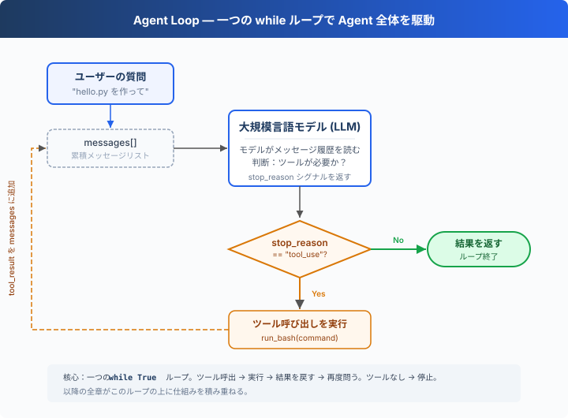

# s01: Agent Loop — ループ一つで十分

[English](README.md) · [中文](README.zh.md) · [日本語](README.ja.md)

`s01` → [s02](../s02_tool call/) → s03 → s04 → ... → s16 → s17
> *"One loop & Bash is all you need"* — ツール一つ + ループ一つ = 一つの Agent。
>
> **Harness レイヤー**: ループ — モデルと現実世界をつなぐ最初の架け橋。


> **DeepSeek implementation note**: This repository uses DeepSeek's OpenAI-compatible API. The runnable `code.py` calls `client.chat.completions.create(...)`, reads `response.choices[0].message`, checks `message.tool_calls`, and sends each result as a `{"role": "tool", "tool_call_id": ...}` message.

---

## 課題

モデルにこう頼んだとする：「ディレクトリ内のファイル一覧を取得して、XXX.py を実行して」。

モデルは bash コマンドを出力できるが、出力が終わると止まってしまう — 自分で実行することも、結果を見て推論を続けることもない。

手動で実行し、出力をチャットに貼り付ければ、モデルは続きを生成できる。次のコマンドが出たら、また実行して貼り付ける。

毎回の往復で、あなたが中間層になっている。これを自動化するのが、この章の目的だ。

---

## ソリューション



一つの `while True` ループ — モデルがツールを呼べば続き、呼ばなければ停止。全体でたった 2 つのシグナル：

| シグナル | 意味 | ループの動作 |
|----------|------|-------------|
| `message.tool_calls` | モデルが「ツールが必要」と挙手 | 実行 → 結果を戻す → 続行 |
| `not message.tool_calls` | モデルが「完了」と宣言 | ループ終了 |

---

## 仕組み

このプロセスをコードに変換してみよう。ステップごとに：

**ステップ 1**：ユーザーの質問を最初のメッセージとして設定する。

```python
messages = [{"role": "user", "content": query}]
```

**ステップ 2**：メッセージとツール定義を一緒に LLM に送信する。

```python
response = client.chat.completions.create(
    model=MODEL, messages=messages,
    tools=TOOLS, max_tokens=8000,
)
message = response.choices[0].message
```

**ステップ 3**：モデルの応答を追加し、ツールを呼び出したか確認する。呼び出しなし → 終了。

```python
messages.append(message.model_dump(exclude_none=True))
if not message.tool_calls:
    return
```

**ステップ 4**：モデルが要求したツールを実行し、結果を収集する。

```python
for tool_call in message.tool_calls:
    command = json.loads(tool_call.function.arguments)["command"]
    output = run_bash(command)
    messages.append({
        "role": "tool",
        "tool_call_id": tool_call.id,
        "content": output,
    })
```

**ステップ 5**：ツールの結果を新しいメッセージとして追加し、ステップ 2 に戻る。

```python
# Tool results are appended inside the loop above.
```

完全な関数に組み立てる：

```python
def agent_loop(messages):
    while True:
        response = client.chat.completions.create(
            model=MODEL, messages=messages,
            tools=TOOLS, max_tokens=8000,
        )
        message = response.choices[0].message
        messages.append(message.model_dump(exclude_none=True))

        if not message.tool_calls:
            return

        for tool_call in message.tool_calls:
            command = json.loads(tool_call.function.arguments)["command"]
            output = run_bash(command)
            messages.append({
                "role": "tool",
                "tool_call_id": tool_call.id,
                "content": output,
            })
```

30 行未満 — これが最小実行可能な agent harness のカーネルだ。これは知能そのものではなく、モデルが継続的に行動できるための最小ランタイムフレームワーク。モデルが決定し（ツールを呼ぶか、どれを呼ぶか）、harness が実行を担う（ツールを呼び出し、結果を新しいメッセージとして追加する）。次の 16 章はすべてこのループの上に仕組みを積み重ねていく。ループ自体は永遠に変わらない。

---

## 試してみよう

> **安全上の注意**: このコードはモデルが生成したシェルコマンドを実行します。プロジェクトファイルへの影響を避けるため、一時テストディレクトリで実行してください。s03 で権限制御を追加します。

**準備**（初回のみ）：

```sh
pip install -r requirements.txt
cp .env.example .env
# .env を編集して DEEPSEEK_API_KEY を設定（デフォルトモデルは deepseek-v4-flash）
```

**実行**：

```sh
python s01_agent_loop/code.py
```

以下のプロンプトを試してみよう：

1. `Create a file called hello.py that prints "Hello, World!"`
2. `List all Python files in this directory`
3. `What is the current git branch?`

観察のポイント：モデルがツールを呼び出すとき（ループ継続）、呼び出さないとき（ループ終了）の違い。

---

## 次へ

現在、モデルが持っているのは bash だけだ — ファイルを読むには `cat`、書くには `echo ... >`、探すには `find`。不便でエラーも起きやすい。

→ s02 Tool Use：5 つの本格的なツールを与えたらどうなる？ モデルは複数のツールを同時に呼び出すか？ 並列実行で競合は起きないか？


<!-- translation-sync: zh@v2, en@v2, ja@v2 -->
