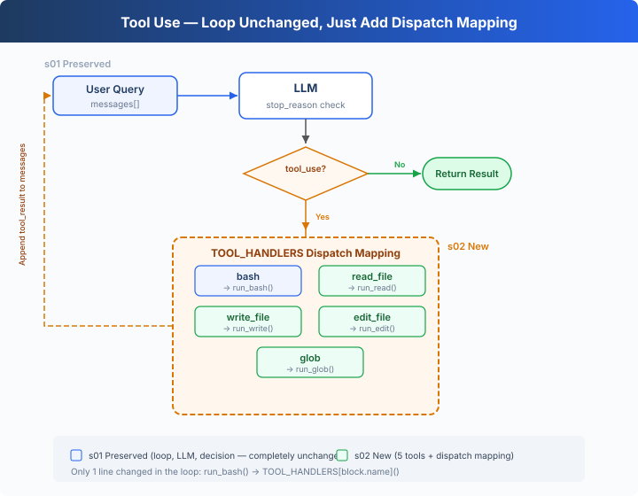

# s02: Tool Use — Add a Tool, Add Just One Line

[English](README.md) · [中文](README.zh.md)

s01 → `s02` → [s03](../s03_permission/) → s04 → ... → s16 → s17
> *"Add a tool, add just one handler"* — The loop stays the same. Register the new tool in the dispatch map and you're done.
>
> **Harness Layer**: Tool Dispatch — Expanding the model's reach.


> **DeepSeek implementation note**: This repository uses DeepSeek's OpenAI-compatible API. The runnable `code.py` calls `client.chat.completions.create(...)`, reads `response.choices[0].message`, checks `message.tool_calls`, and sends each result as a `{"role": "tool", "tool_call_id": ...}` message.

---

## Only One Tool: Bash

The s01 Agent has only one tool: bash. To read a file, `cat`; to write, `echo "..." > file.py`; to edit, `sed`.

The model thinks "read this file" but has to spell out `cat path/to/file`. An extra layer of translation that wastes tokens and invites errors.

---

## Overview: Tool Dispatch



The s01 loop is fully preserved (LLM call, tool_calls check check, message append — not a single word changed). The only change is in that one line of tool execution: `run_bash()` is replaced with `TOOL_HANDLERS[block.name]()` dispatch lookup.

Adding a tool to the Agent requires just two things:

1. **Define the tool**: Add one entry to the `TOOLS` array
2. **Register the handler**: Add one mapping in the `TOOL_HANDLERS` dict

---

## From 1 Tool to 5 Tools

s01 had only bash:

```python
TOOLS = [{"name": "bash", ...}]

def run_bash(command): ...
```

s02 expands to 5 tools, each independently defined:

```python
TOOLS = [
    {"name": "bash",       "description": "Run a shell command.", ...},
    {"name": "read_file",  "description": "Read file contents.",  ...},
    {"name": "write_file", "description": "Write content to file.", ...},
    {"name": "edit_file",  "description": "Replace text in file once.", ...},
    {"name": "glob",       "description": "Find files by pattern.", ...},
]
```

Each tool has its own implementation function:

```python
def run_read(path, limit=None):
    lines = safe_path(path).read_text().splitlines()
    if limit:
        lines = lines[:limit]
    return "\n".join(lines)

def run_write(path, content):
    safe_path(path).write_text(content)
    return f"Wrote {len(content)} bytes to {path}"

def run_edit(path, old_text, new_text):
    text = safe_path(path).read_text()
    if old_text not in text:
        return "Error: text not found"
    safe_path(path).write_text(text.replace(old_text, new_text, 1))
    return f"Edited {path}"

def run_glob(pattern):
    import glob as g
    return "\n".join(g.glob(pattern, root_dir=WORKDIR))
```

---

## Tool Dispatch

```python
TOOL_HANDLERS = {
    "bash":       run_bash,
    "read_file":  run_read,
    "write_file": run_write,
    "edit_file":  run_edit,
    "glob":       run_glob,
}

# Only one line changed in the loop — from hardcoded run_bash to dispatch lookup:
for tool_call in message.tool_calls:
    name = tool_call.function.name
    arguments = json.loads(tool_call.function.arguments)
    handler = TOOL_HANDLERS[name]
    output = handler(**arguments)
    messages.append({
        "role": "tool", "tool_call_id": tool_call.id, "content": output,
    })
```

Adding a tool = one entry in `TOOLS` array + one line in `TOOL_HANDLERS` dict. The loop stays the same.

---

## Multiple Tool Calls

The model often returns multiple tool calls at once — "read a.py and b.py, then list all .py files".

Calls are executed one by one in their original `message.tool_calls` order.

---

## Quick Reference

| Concept | One-Liner |
|---------|-----------|
| TOOL_HANDLERS | Tool name → handler function dict. Add a tool = add one mapping line |
| Tool Definition | JSON schema telling the model "what I can do" |
| Multiple tool calls | Model may return multiple tool call at once; calls execute in their original order |
| Loop Unchanged | s01's `while True` loop — not a single line changed |

---

## Changes from s01

| Component | Before (s01) | After (s02) |
|-----------|-------------|-------------|
| Tool count | 1 (bash) | 5 (+read, write, edit, glob) |
| Tool execution | Hardcoded `run_bash()` | TOOL_HANDLERS dispatch lookup |
| Path safety | None | safe_path validation (file tools only) |
| Loop | `while True` + `tool_calls check` | Identical to s01 |

---

## Try It

```sh
cd deepseek-agent-tutorial
python s02_tool call/code.py
```

Try these prompts:

1. `Read the file README.md and tell me what this project is about`
2. `Create a file called test.py that prints "hello", then read it back`
3. `Find all Python files in this directory`
4. `Read both README.md and requirements.txt, then create a summary file`

What to watch for: When does the model call just one tool, and when does it call multiple at once? Are multiple tool calls executed in the correct order?

---

## What's Next

The Agent now has 5 specialized tools. File tools are protected by `safe_path`, but bash is unrestricted — `rm -rf /` still runs.

→ s03 Permission: Add a gate before tool execution — is this operation safe? Does it need user approval?


<!-- translation-sync: zh@v1, en@v1, ja@v1 -->
